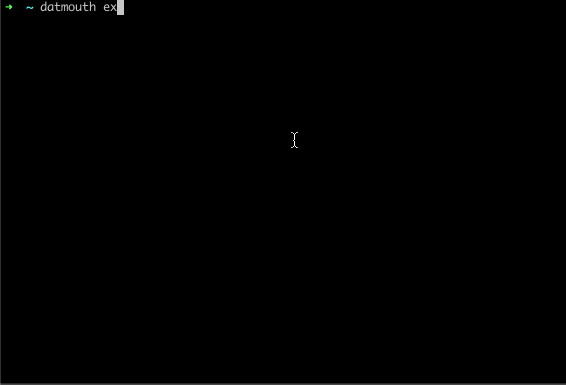

# datmouth

P2P chat client that uses DAT protocol underneath.

Have you lost your internet connection? 

Works with peers connected:
- offline
- LAN
- WAN

Inspired by [DAT](https://dat.foundation/) foundation workshops and great packages in the community.

datmouth does not work under **node 14** yet.

hypercore, multifeed and all the dat related deck is being updated while you see this message. Hang on!

# Install

```
$ npm install -g datmouth
```

# Usage

```
$ datmouth topicname
```

Will join the swarm automatically. You can share the topic with a friend and start chatting



# Already joined a topic?

```
Commands:
  /help                 Displays this message
  /nick yournickname    Changes your actual nickname
  /history 4            Displays last 4 messages received

Emacs commands:
  CTRL-U                Remove from cursor to start of line
  CTRL-A                Go to start of the line
  CTRL-E                Go to end of the line
  ALT-B                 Move cursor backwards, word by word
  ALT-F                 Move cursor forward, word by word
```

# Want to contribute?

[Here](docs/devs.md) is how to get started